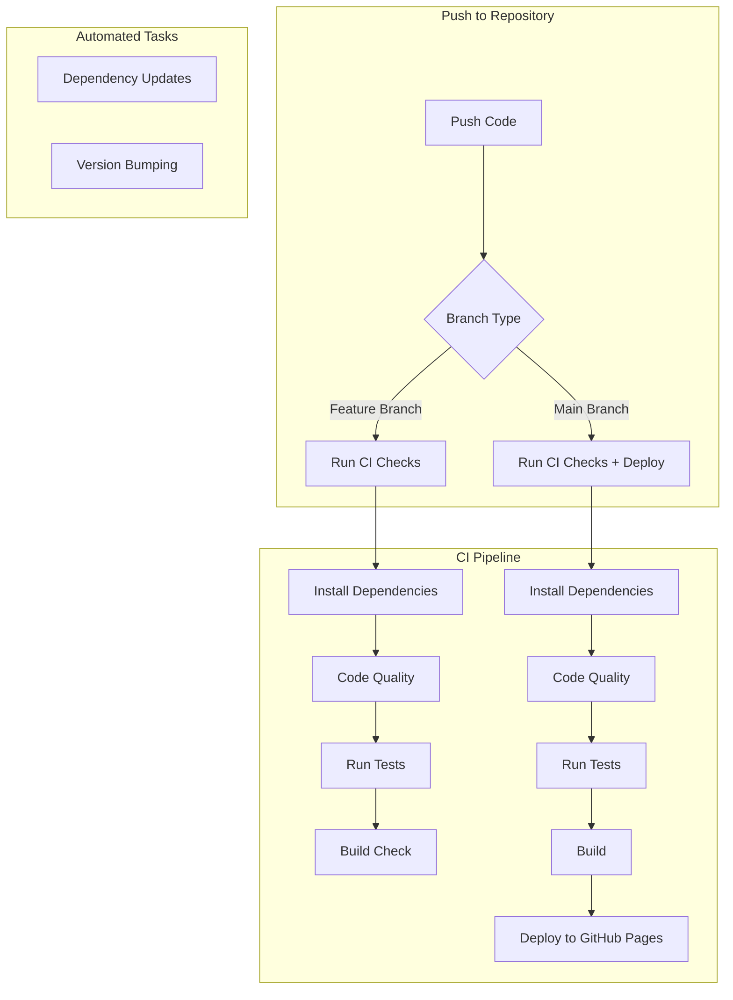

# CI/CD Pipeline Implementation Plan

## Overview

This document outlines the CI/CD pipeline configuration for the Atomas game clone project, a React + TypeScript application using Vite as the build tool.



## Implementation Details

### 1. GitHub Actions Workflow Setup

#### A. CI Pipeline (`ci.yml`)
- Setup Node.js & pnpm
- Cache dependencies
- Install dependencies
- Run code quality checks:
  * TypeScript compilation
  * ESLint
  * Prettier
- Execute test suite
- Verify build process

#### B. Deployment Pipeline (`deploy.yml`)
- Triggers on main branch pushes
- Runs after successful CI checks
- Builds for production
- Deploys to GitHub Pages
- Updates version using conventional commits

#### C. Dependency Updates (`deps-update.yml`)
- Automated dependency updates
- Weekly schedule
- Security patches priority

### 2. Repository Configuration

#### Branch Protection Rules
```yaml
main:
  - Required status checks must pass
  - Prevent force pushes
  - Auto-delete merged branches
```

#### Required Status Checks
- TypeScript compilation
- ESLint validation
- Test suite completion
- Build verification

### 3. Build & Deploy Configuration

#### A. Vite Configuration
```typescript
export default defineConfig({
  base: process.env.GITHUB_PAGES ? '/atomas/' : '/',
  build: {
    outDir: 'dist'
  }
})
```

#### B. Environment Variables
```env
GITHUB_TOKEN=<repository-access-token>
NODE_ENV=production
BASE_URL=/atomas/
```

### 4. Automation Setup

#### A. Dependabot Configuration
```yaml
version: 2
updates:
  - package-ecosystem: "npm"
    directory: "/"
    schedule:
      interval: "weekly"
    versioning-strategy: "auto"
    target-branch: "main"
```

#### B. Version Management
- Use semantic versioning (MAJOR.MINOR.PATCH)
- Automated version bumps based on conventional commits
- Automatic changelog generation
- Commit message format enforcement

### 5. Documentation

#### Status Badges
```markdown
[](https://github.com/[owner]/atomas/actions/workflows/ci.yml)
[](https://github.com/[owner]/atomas/actions/workflows/deploy.yml)
[](https://dependabot.com)
```

#### Required Documentation Updates
1. Add status badges to README.md
2. Document deployment process
3. Maintain CHANGELOG.md
4. Update contribution guidelines

## Next Steps

1. Create GitHub Actions workflow files
2. Configure branch protection rules
3. Set up environment variables
4. Update Vite configuration
5. Implement documentation changes